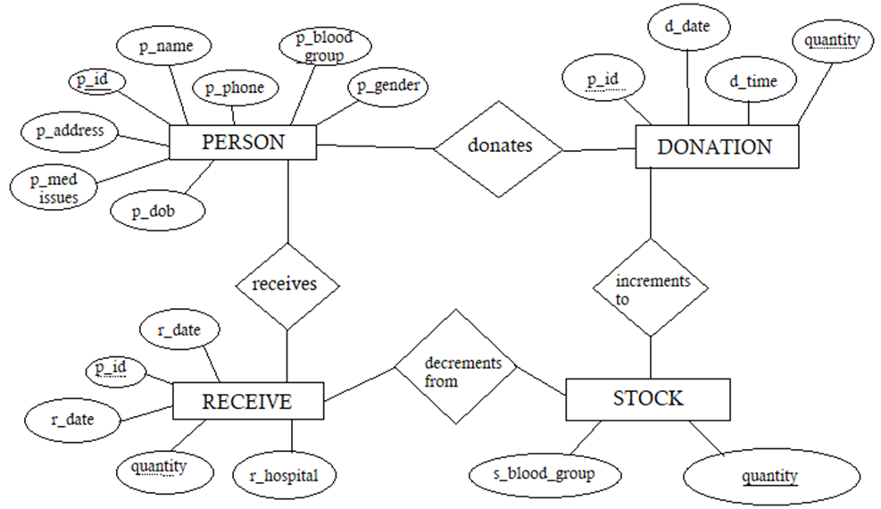

# Blood Donation Database Management System

## Abstract

The **Blood Donation Management System** is an application designed to manage and track the process of blood donation. The system allows users to record donations, manage donor and recipient data, track blood stock, and facilitate blood donations and transfusions. It aims to simplify the management of blood donation events and ensure that the required amount of blood is available for medical emergencies. Through a user-friendly interface, administrators and medical staff can efficiently handle the logistics involved in blood donation and storage.

## ER Diagram


## Features

- **Donor Management**: Record and manage details of blood donors including personal information and blood group.
- **Donation Management**: Record blood donations, track the quantity donated, and update blood stock levels.
- **Recipient Management**: Manage records of recipients receiving blood transfusions.
- **Stock Management**: Automatically track the quantity of blood available in stock for each blood group.
- **Search Functionality**: Search donors, donations, and recipients by name or phone number to easily find relevant records.
- **CRUD Operations**: Perform Create, Read, Update, and Delete operations on donor, donation, and recipient records.
- **User-friendly Interface**: Simple and intuitive UI with responsive forms for data entry and management.
- **Data Validation**: Ensure that the data entered (like quantity and dates) is valid and within acceptable ranges.
- **Confirmation on Deletion**: Ensure accidental deletions are prevented with confirmation prompts.

## System Requirements

- **Operating System**: Cross-platform (Linux, macOS, Windows)
- **Python Version**: 3.x
- **Database**: SQLite (or any other relational database like PostgreSQL or MySQL for production)
- **Libraries and Dependencies**:
  - Flask (for web framework)
  - SQLAlchemy (for ORM and database management)
  - Jinja2 (for templating)
  - Werkzeug (for security and utilities)
  - Bootstrap (for UI styling)

To install the necessary dependencies:
```bash
pip install -r requirements.txt
```

## Design
The system is built using the Flask web framework with SQLAlchemy for database management. The main entities in the system include:

1. Person: Represents a blood donor or recipient with attributes like name, phone number, blood group, and medical issues.
2. Donation: Represents a blood donation event, including the donor, quantity donated, and date.
3. Receive: Represents a blood transfusion event for recipients.
4. Stock: Represents the quantity of available blood for each blood group in the stock.

## Database Schema
- Person: Stores personal details of donors and recipients (name, phone, blood group, etc.).
- Donation: Stores details about donations, including donor ID and quantity.
- Receive: Tracks the quantity of blood received by recipients.
- Stock: Manages the blood stock levels for each blood group.

## Project Flow
1. Donation Process: Donors can record their donations, which are added to the stock and the donation history.
2. Blood Stock Update: Blood stock is updated automatically based on the quantity of blood donated or received.
3. Search and Management: Admins can search for specific donors, donations, or recipients by their name or phone number and perform actions like editing or deleting records.
4. Receive Process: Recipients can be matched with available blood groups, and the necessary amount is deducted from the stock when a transfusion is recorded.

## Future Enhancements
1. Mobile Application: Developing a mobile app version to allow users to track their donation history, receive notifications for donation drives, and make blood donations more convenient.
2. Donation Scheduling: Implement a feature that allows users to schedule donations based on available dates and times.
3. Donor Reminders: Automatic reminders for donors when it’s time for their next donation, based on donation history.
4. Geolocation Integration: Integrate with GPS to help users locate nearby donation centers and blood banks.
5. Reporting and Analytics: Generate reports for blood donation statistics, stock levels, and recipient requirements for better decision-making.
6. User Authentication: Implement secure user login and authentication for staff and admin roles.
7. Real-Time Stock Updates: Real-time synchronization of stock across multiple locations or donation centers for accurate and up-to-date records.